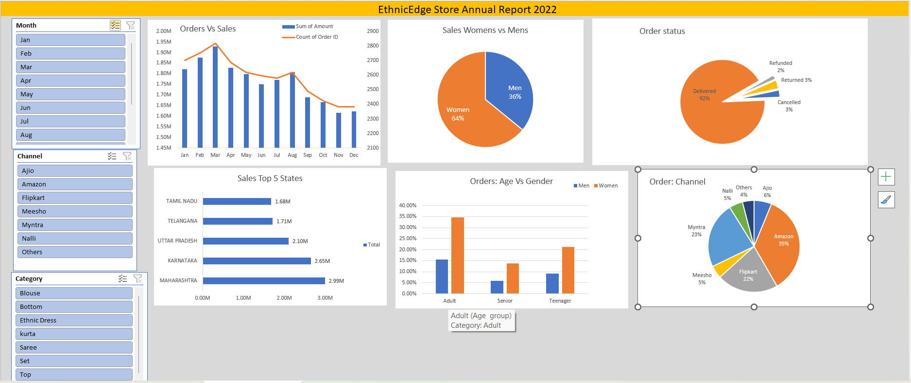

# 🛍️ EthnicEdge Store — Annual Sales Report 2022

An Excel-based data analysis project that cleans, processes, and visualizes e-commerce order data for **EthnicEdge Store** — an Indian fashion retailer specializing in ethnic wear, selling across major platforms.

---

## 📸 Project Output (Dashboard Preview)

> This dashboard represents the final insights generated using pivot tables and Excel visualizations.

---

## 📁 Project Structure

The workbook contains the following sheets:

| Sheet                          | Description                                              |
| ------------------------------ | -------------------------------------------------------- |
| `EthnicEdge Store`             | Raw order data (~31,000+ rows)                           |
| `Data cleaning`                | Cleaned version of the raw data                          |
| `Data processing`              | Enriched data with `Age group` and `Month` columns added |
| `Data analysis`                | Pivot tables and summary calculations                    |
| `sales vs order`               | Monthly comparison of total sales amount vs. order count |
| `EthnicEdge store report 2022` | Final annual report summary                              |
| `men vs women`                 | Revenue breakdown by gender                              |
| `order status`                 | Count of orders by fulfillment status                    |
| `States`                       | Top 5 states by total sales amount                       |
| `age and gender`               | Order distribution across age groups and gender          |
| `Channel`                      | Sales share by e-commerce platform                       |

---

## 📊 Key Insights

* **Total Revenue**: ₹21,100,334
* **Women outspent Men** ~1.8x (₹13.5M vs ₹7.6M)
* **Top State**: Maharashtra (₹2.99M), followed by Karnataka and Uttar Pradesh
* **Best Month**: March (₹1.93M, 2,819 orders)
* **Top Channel**: Amazon (35.5%), followed by Myntra (23.4%) and Flipkart (21.6%)
* **Delivery Rate**: ~92% of orders delivered successfully
* **Age Group**: Adults (26–50) drove the most purchases across both genders

---

## 🧹 Data Cleaning Steps

* Standardized inconsistent `Gender` values
* Removed extra spaces from entries
* Maintained date format for pivot compatibility

---

## ⚙️ Data Processing

* Created **Age Group** column (Teenager, Adult, Senior)
* Extracted **Month** from order date

---

## 🛠️ Tools Used

* Microsoft Excel (Data Cleaning, Pivot Tables, Dashboard)

---

## ⚠️ Disclaimer

> This project is created for learning and portfolio purposes using a sample dataset.
